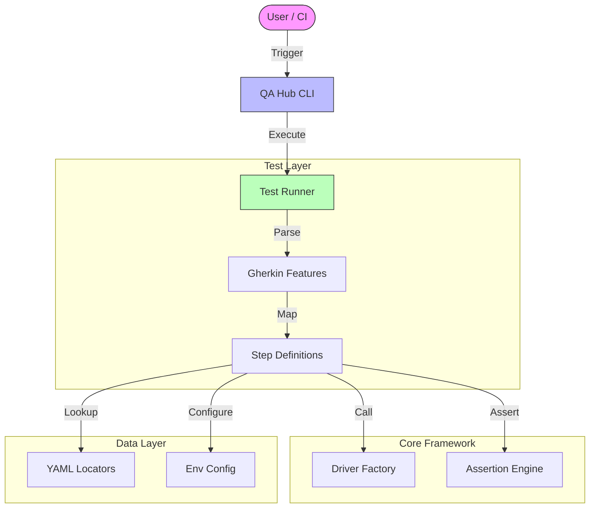

<div align="center">

# QA Hub Framework Example
### 🚀 Enterprise-Grade Test Automation Standard

[](https://github.com/carlos-camara/qa-hub-framework-example/actions/workflows/tests.yml)
[](https://github.com/carlos-camara/qa-hub-framework-example/actions/workflows/lint.yml)
[](https://www.python.org/downloads/)
[](https://opensource.org/licenses/MIT)

<br>

**Accelerate your Quality Assurance with a framework designed for rigor, scalability, and developer joy.**  
*Strict Typing • YAML-Driven Locators • Zero-Boilerplate Gherkin*

[Report Bug](https://github.com/carlos-camara/qa-hub-framework-example/issues) · [Request Feature](https://github.com/carlos-camara/qa-hub-framework-example/issues)

</div>

---

## 🏛️ Executive Summary

This repository serves as the **Gold Standard Reference Implementation** for the [QA Hub Framework](https://github.com/carlos-camara/qa-hub-framework). It is not just a demo; it is a blueprint for building high-performance automation suites that scale with your enterprise.

Here, you will find a fully functional test suite for **DuckDuckGo**, demonstrating how to orchestrate:
- **GUI Testing**: Robust, self-healing Selenium/Playwright interactions.
- **API Testing**: High-speed HTTP validations integrated seamlessy.
- **CI/CD Pipelines**: Production-ready GitHub Actions workflows.

---

## 💎 why QA Hub?

We believe test automation should be **resilient by default** and **readable by everyone**.

| Feature | Impact |
| :--- | :--- |
| **Separation of Concerns** | Locators live in strict YAML files, keeping your code pure and logic-focused. |
| **Universally Readable** | Gherkin steps are written in natural language, bridging the gap between QA, Dev, and Product. |
| **Diagnostic Clarity** | Context-aware logging and screenshot capture on failure mean zero-guessing debugging. |
| **Execution Agility** | Unified CLI for running tests locally, in Docker, or on remote CI runners without config hell. |

---

## 🛠️ System Architecture

Our **Layered Architecture** ensures long-term maintainability. Changes in the UI don't break your logic; changes in logic don't break your data.



---

## 🚀 Getting Started

<details>
<summary><b>1. Environmental Prerequisites</b></summary>

Ensure you have Python 3.10+ installed.

```bash
# Clone the repository
git clone https://github.com/carlos-camara/qa-hub-framework-example.git
cd qa-hub-framework-example

# Create Virtual Environment
python -m venv .venv
source .venv/bin/activate  # Windows: .venv\Scripts\activate

# Install Dependencies
pip install -r requirements.txt
```
</details>

<details open>
<summary><b>2. Execution Guide</b></summary>

Use the powerful **QA Hub CLI** to run your tests.

```bash
# 🟢 Run Smoke Tests
python -m qa_framework.cli run --tags @smoke

# 🖥️ Run GUI Tests in Headed Mode (Visual)
python -m qa_framework.cli run --path features/duckduckgo/gui/ --no-headless

# 📊 Generate Allure Reports (Optional)
python -m qa_framework.cli run --tags @regression --report allure
```
</details>

---

## 📂 Project Blueprint

A clean structure for a clean mind.

```text
qa-hub-framework-example/
├── .github/workflows/       # 🤖 CI/CD Pipelines (Lint, Test, Release)
├── features/                # 🧪 Test Specifications
│   ├── config/              #    ├── Environment Configuration
│   ├── duckduckgo/          #    ├── Domain-Specific Features
│   ├── page_objects/        #    ├── YAML Locator Definitions
│   └── steps/               #    └── Step Implementations
├── requirements.txt         # 📦 Dependency Management
└── README.md                # 📘 You are here
```

---

## 🛡️ Governance & Standards

We commit to the highest standards of engineering excellence.

*   **Security**: Please refer to our [Security Policy](SECURITY.md).
*   **Conduct**: We foster an inclusive environment via our [Code of Conduct](CODE_OF_CONDUCT.md).
*   **Contribution**: Want to help? Check out our [Contributing Guidelines](.github/CONTRIBUTING.md).

---

<div align="center">
  <small>Designed & Engineered by <a href="https://github.com/carlos-camara">Carlos Cámara</a></small>
</div>
