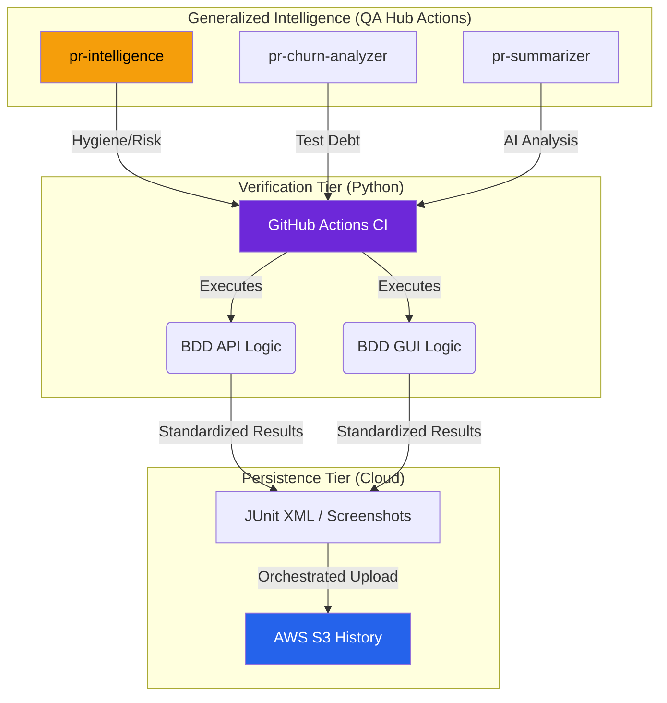

<div align="center">
  <h1>🛡️ QA HUB: REFERENCE IMPLEMENTATION</h1>
  
  <h3>Next-Gen Orchestration & Engineering Intelligence</h3>
  <p><i>The Gold Standard blueprint for building high-performance, ultra-premium automation suites.</i></p>
</div>

<div align="center">

[](https://www.python.org/)
[](https://github.com/carlos-camara/qa-hub-framework)
[](LICENSE)

[](https://github.com/carlos-camara/qa-hub-framework-example/actions/workflows/test_suite.yml)
[](https://github.com/carlos-camara/qa-hub-framework-example/actions/workflows/lint.yml)
[](https://github.com/carlos-camara/qa-hub-framework-example/actions/workflows/pr_intelligence.yml)

</div>

<br/>

---

## 🌟 Executive Overview

This repository is the **mission-critical reference** for the [QA Hub Framework](https://github.com/carlos-camara/qa-hub-framework). It demonstrates a high-fidelity implementation of BDD-driven automation for DuckDuckGo, engineered for surgical precision and executive-ready reporting.

> [!IMPORTANT]
> **Production Ready**: This suite doesn't just run tests; it orchestrates a complete quality lifecycle from PR risk analysis to automated S3 report archival.

### 🚀 The Four Pillars
- **Resilient Execution**: Self-healing GUI interactions and high-speed API validations.
- **Architectural Purity**: Strict separation of concerns via YAML-driven locators and generic steps.
- **Engineering Intelligence**: Powered by generalized actions for PR hygiene, risk detection, and churn analysis.
- **Enterprise Orchestration**: Standardized CI/CD pipelines with central S3 synchronization.

---

## 🏗️ Ecosystem Architecture

Our layered architecture ensures zero-debt maintainability and high-fidelity verification, delegating heavy intelligence to global, reusable components.



---

## 🛠️ Performance-Driven CI/CD

| Status | Pipeline | Operational Responsibility |
| :---: | :--- | :--- |
| `💅` | **Lint - Super-Linter** | Enforcement of zero-debt documentation and logic standards. |
| `🧪` | **Unified Suite** | Surgical execution of API and GUI verification layers. |
| `🧠` | **PR Intelligence** | Dynamic labeling, risk analysis, and automated summaries via `qa-hub-actions`. |
| `☁️` | **Report Archival** | Automated deployment to S3 with standardized project pathing. |

---

## 🚦 Navigation & Initialization

### 📋 Prerequisites
- **Python**: v3.10+
- **Chrome / Chromedriver**: Required for full GUI verification.
- **Git**: Standard workflow.

### 💻 Fast Setup
```bash
# Obtain Registry
git clone https://github.com/carlos-camara/qa-hub-framework-example.git
cd qa-hub-framework-example

# Initialize Environment
python -m venv .venv
source .venv/bin/activate  # Windows: .venv\Scripts\activate
pip install -r requirements.txt
```

### 🎯 Registry Execution
```bash
# 🟢 Smoke Suite (High-Speed Selection)
python -m qa_framework.cli run --tags @smoke

# 🖥️ Visual Execution (Headed)
python -m qa_framework.cli run --path features/duckduckgo/gui/ --no-headless

# 🏢 Standardized Project Run (Centralized Reporting)
python -m qa_framework.cli run --project duckduckgo-example
```

---

## 🛡️ Elite Governance

This repository adheres to the highest standards of open-source maintenance and engineering excellence.

- 📈 <div align="center">
  <h1>📔 Project Changelog</h1>
  <p><i>High-fidelity documentation of the project's architectural evolution and technical milestones.</i></p>
</div>
](CHANGELOG.md) - High-fidelity history of ecosystem evolution.
- 🤝 [Contribution Blueprint](CONTRIBUTING.md) - Guidelines for high-performance contributions.
- 🛡️ [Security Policy](SECURITY.md) - Responsible disclosure and vulnerability management.
- 📜 [Code of Conduct](CODE_OF_CONDUCT.md) - Commitment to a professional community.

---
<div align="center">
  <i>Designed & Engineered with Precision by <b><a href="https://github.com/carlos-camara">Carlos Cámara</a></b></i>
</div>
