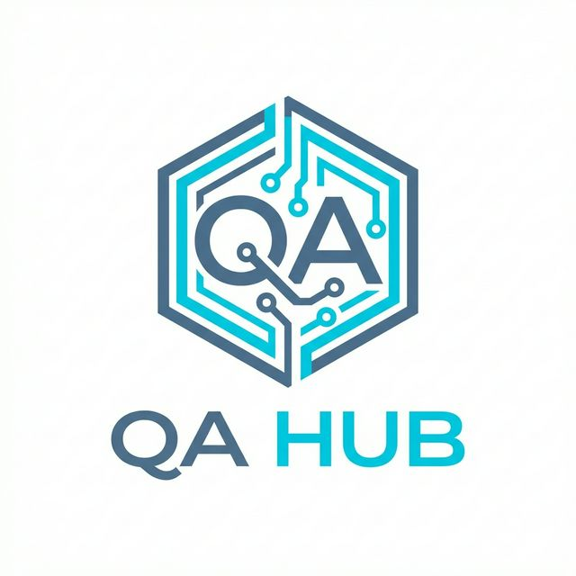
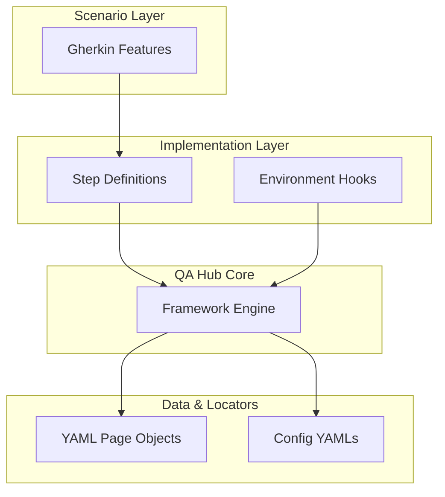

# 🧪 QA Hub Framework Example

<div align="center">
  
  
  ### Better Testing • Faster Feedback • Total Confidence
  
  [](https://opensource.org/licenses/MIT)
  [](https://www.python.org/downloads/release/python-3100/)
  [](https://github.com/carlos-camara/qa-hub-framework-example/actions/workflows/lint.yml)
  [](https://github.com/carlos-camara/qa-hub-framework-example/actions/workflows/tests.yml)
  
  **A premier reference implementation for the QA Hub Framework.**
</div>

---

## 🌟 Overview

The **QA Hub Framework Example** showcases how to build world-class, hybrid automation suites (API + GUI) using specialized **QA Hub** patterns. This repository serves as a blueprint for engineering leads and specialized QA engineers who seek to bridge the gap between technical excellence and business value.

## 🏗️ Technical Architecture

This project strictly adheres to the **QA Hub Decoupled Architecture**, ensuring that test logic remains independent of implementation details and environment configurations.



## 🎯 Value Propositions

- **🚀 Velocity**: Out-of-the-box support for parallel execution and optimized CI/CD pipelines.
- **🧩 Composability**: Leverage existing framework steps or create your own with minimal boilerplate.
- **📊 Observability**: Built-in `ContextualLogger` and automatic artifact generation on failures.
- **🛡️ Quality Gates**: Standardized linting and regression testing integrated into every Pull Request.

## 🚀 Quick Start

### 1. Installation

```bash
# Clone the repository
git clone https://github.com/carlos-camara/qa-hub-framework-example

# Install everything with one command
pip install -r requirements.txt
```

### 2. Execution Registry

| Target | Core Command |
| :--- | :--- |
| **GUI Context** | `python -m qa_framework.cli run --path features/duckduckgo/gui --tags '@smoke'` |
| **API Context** | `python -m qa_framework.cli run --path features/duckduckgo/api --tags '@smoke'` |

## 📁 Repository Blueprint

```text
├── .github/             # Modular CI/CD & Project Governance
├── assets/              # Branding & Visual Identity
├── features/
│   ├── config/          # Environment-driven Configuration
│   ├── duckduckgo/      # Domain-specific Scenarios
│   ├── page_objects/    # Zero-Code YAML Locators (POM)
│   ├── steps/           # Reusable Step Logic
│   └── environment.py   # Global Hook Registry
└── docs/                # Technical Documentation & Guides
```

## 🔧 Developer Experience (DX)

- **Local Validation**: Run `lint_local.bat` to ensure code compliance before pushing.
- **Self-Healing Dependencies**: Automated weekly updates via **Dependabot**.
- **Guided Contributions**: Clear `CONTRIBUTING.md` and Issue Templates for seamless collaboration.
- **API/GUI Step Library**: Reference `docs/steps.md` for the full Gherkin vocabulary.

---

<div align="center">
  <i>Designed & Engineered by <b>[Carlos Cámara](https://github.com/carlos-camara)</b></i>
</div>
