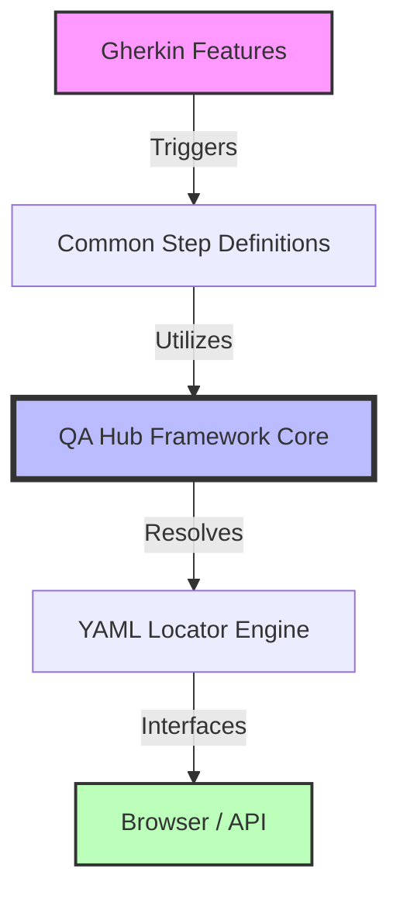

# 🧪 QA Hub Framework Example
> **Accelerating Quality with Enterprise-Grade Automation Patterns**

[](https://github.com/carlos-camara/qa-hub-framework-example/actions/workflows/tests.yml)
[](https://github.com/carlos-camara/qa-hub-framework-example/actions/workflows/lint.yml)
[](https://www.python.org/downloads/)
[](https://opensource.org/licenses/MIT)

---

## 🏛️ Project Overview

This repository serves as the **official reference implementation** for the [QA Hub Framework](https://github.com/carlos-camara/qa-hub-framework). It demonstrates how to build scalable, maintainable, and highly professional automated testing suites for both Web and API layers.

Designed for engineers who demand **rigor without complexity**, this project showcases modern testing excellence through clean code, structured YAML locators, and seamless CI/CD integration.

---

## 💎 Core Pillars

| Pillar | Description |
| :--- | :--- |
| **Maintainability** | Decoupled locators via YAML-based Page Object patterns. |
| **Genericity** | Reusable Gherkin steps that minimize boilerplate code. |
| **Observability** | Context-aware logging and automated artifact capture (screenshots/trace). |
| **Agility** | Standardized CLI for local execution and rapid feedback loops. |

---

## 🛠️ Technical Architecture

The architecture is built on a **Layered Strategy**, ensuring that changes in the UI or API don't ripple through the entire test suite.



---

## 🚀 Quick Start

### 1. Environment Setup
```bash
# Clone the repository
git clone https://github.com/carlos-camara/qa-hub-framework-example.git
cd qa-hub-framework-example

# Create and activate virtual environment
python -m venv .venv
source .venv/bin/activate  # Windows: .venv\Scripts\activate

# Install dependencies
pip install -r requirements.txt
```

### 2. Running Tests
Leverage the standard **QA Hub CLI** for powerful execution control:

```bash
# Run all smoke tests
python -m qa_framework.cli run --tags @smoke

# Run a specific feature in headless mode
python -m qa_framework.cli run --path features/duckduckgo/gui/ --headless
```

---

## 📁 Repository Blueprint

```text
qa-hub-framework-example/
├── .github/workflows/       # Modular CI/CD Pipelines (Lint & Test)
├── features/
│   ├── config/             # Environment-specific configuration
│   ├── page_objects/       # YAML-based Locator Definitions
│   ├── steps/              # Minimalistic project-specific steps
│   └── *.feature           # Narrative-driven test scenarios
├── requirements.txt         # Standard Framework Integration
└── README.md                # Project documentation
```

---

## 🛡️ Governance & Quality

We adhere to the highest standards of professional software development:

*   **Security First**: Review our [Security Policy](SECURITY.md) for vulnerability reporting.
*   **Community Standards**: Our [Code of Conduct](CODE_OF_CONDUCT.md) ensures a professional and inclusive environment.
*   **Automated Quality**: Every PR is subjected to rigorous linting and functional verification via GitHub Actions.

---

<div align="center">
  <i>Designed & Engineered by <b>[Carlos Cámara](https://github.com/carlos-camara)</b></i>
</div>
